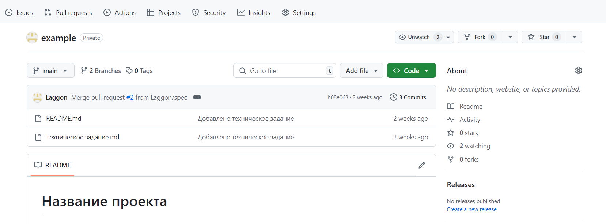
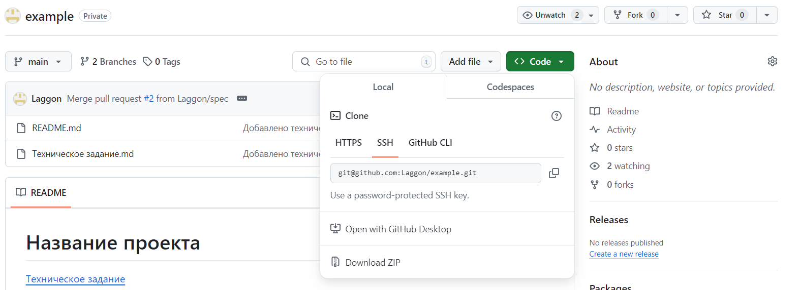
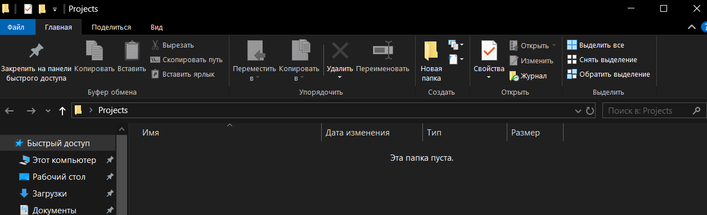
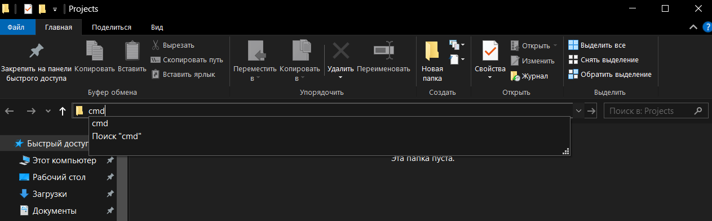
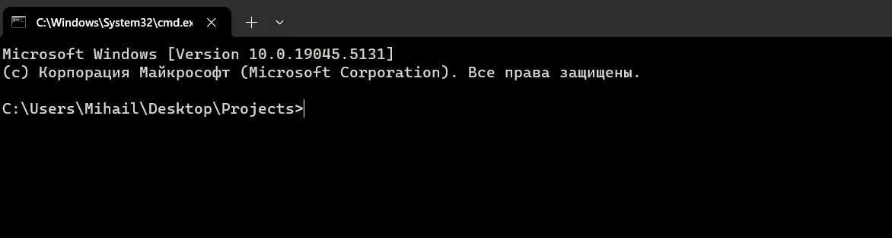
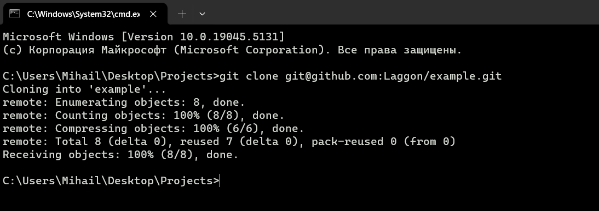
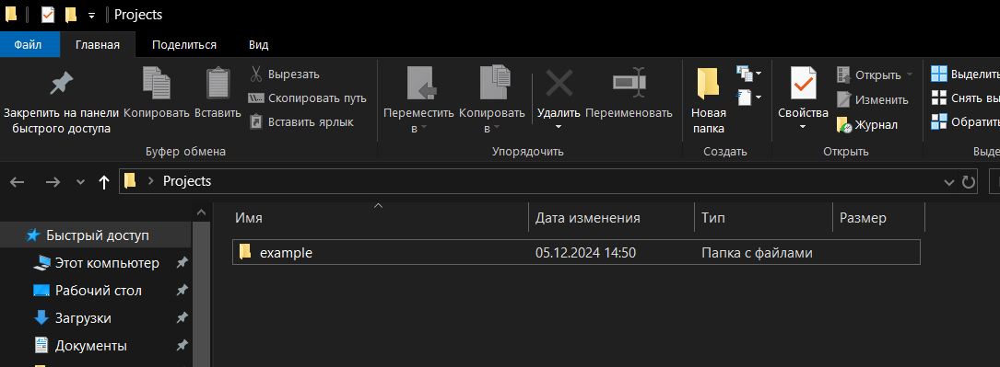
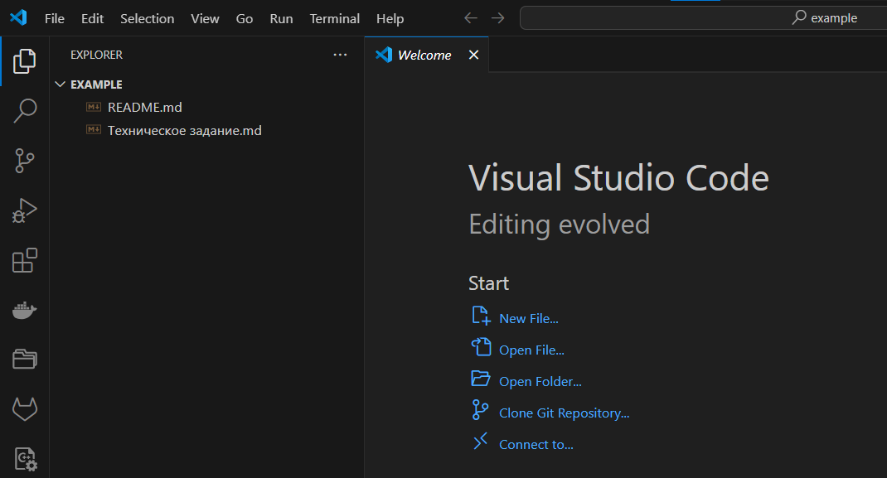

# Клонирование существующего репозитория

Заходим в проект на GitHub, который нужно клонировать (подключить) к себе на компьютер.



> В инструкции ранее указано как сгенерировать SSH-ключ и добавить его в свой аккаунт на GitHub.

Нажимем кнопку `Code`, чтобы скопировать ссылку для клонирования.

Выбираем вкладку `SSH` (данный способ более удобный и безопасный, чем HTTPS).

Копируем ссылку, в данном случае она:

```text
git@gitlab.com/Laggon/example.git
```



Переходим (если необходимо, то создаем) папку в которую нужно будет клонировать репозиторий (в ней будет создана папка с названием проекта, в данном случае `example`).



Чтобы открыть командную строку в данной папке, в адресной строке указываем команду

```sh
cmd
```

И нажимем `Enter`



Откроется терминал в данной папке



Далее выполняем команду клонирования репозитория по ссылке, которую скопировали ранее из вкладки `Code`

```text
git clone git@github.com:Laggon/example.git
```

> Если при создании `SSH-ключа` был указан пароль, то перед выполнением потребуется его ввести

Сообщение при успешном выполнении клонирования



В папке появится папка с репозиторием



Папку можно открыть с помощью `ПКМ - Открыть с помощью VS Code` (если при установке была включена эта опция) или `File - Open Folder` и выбрать папку репозитория (example).


