# Слияние изменений из основной ветки

Учитывая, что работа над задачами ведется в отдельных ветках. Которые создаются на основе основной ветки.

Есть два момента, которые нужно отслеживать:

* отставание от основной ветки - если не было изменений одних и тех же строк, то Git выполнит слияние автоматически
* отставание от основной ветки с конфликтом - если были изменены одни и теже строки, то нужно выполнить слияние вручную

Даже в случае, если отсутствуют конфликты в одних и тех же строках, то в зависимости от структуры проекта код из разных файлов может влиять на работоспособность, поэтому необходимо избавиться от отставания от основной ветки.

Например для работы созданы ветки: page-a и page-b

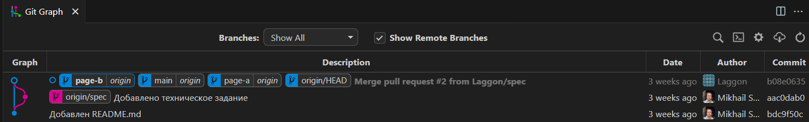

В данных ветках еще нет коммитов, но они уже созданы и опубликованы. Указывают они на тот же коммит, что и основная ветка.

> По возможности нужно распределять задачи в рамках спринта, чтобы не было работы одновременно над одними и теми же строками, чтобы избежать конфликтов. Если в проекте это допускается, то тогда во время слияния нужно будет решить его вручную, так как Git не сможет его решить.

## Действия другого разработчика

> Эти действия по коммитам, PR, ревью и слияние в основную ветку могут проходить до/после/параллельно нашим действиям.

Он внес изменения в `README.md`

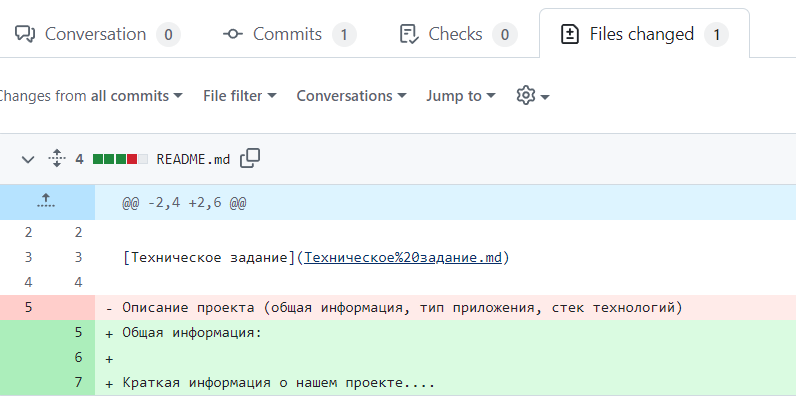

После завершения работы его изменения добавлены в основную ветку.

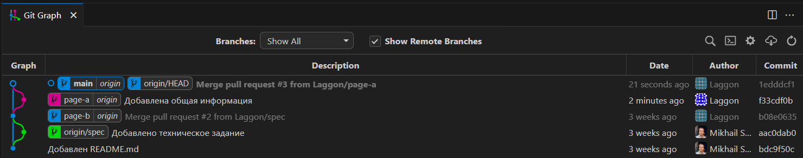

## Наши действия

В свою очередь мы внесли изменения в `README.md`

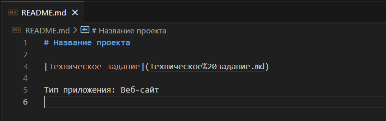

Если изменения другого разработчика были внесены в основную ветку до создания нашего PR, то GitHub предупредит при создании PR о наличии конфликта. На данный момент можно добавить PR и исправить конфликт далее.

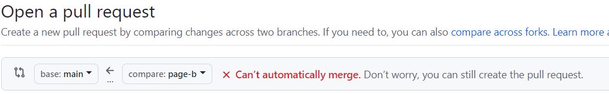

Также проверить готовность PR к слиянию можно во вкладке `Conversation`.

Если имеются конфликты, то будет отображен соответствующий блок.

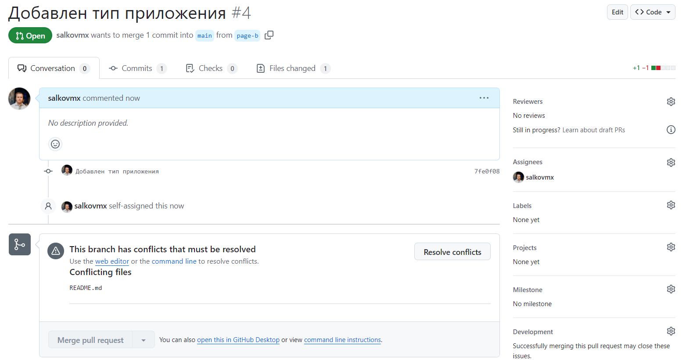

Предпочтительный способ исправления конфликтов - локально. Через веб-интерфейс GitHub можно исправить только простые типы конфликтов, остальные только локально (даже в случае небольших правок (например документации) стоит выполнять локально). Также перед фиксацией изменений слияния стоит проверить работоспособность приложения.

### Отставание

Отставание от основной ветки мы можем увидеть в GitHub перейдя из PR или со страницы репозитория в свою ветку.

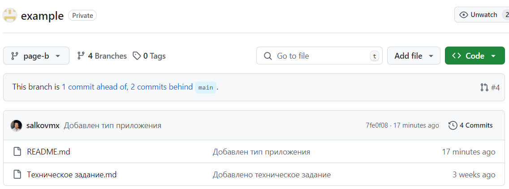

Если в примечании есть `N commits behind`, значит ваша ветка **отстает**.

> N commits ahead - значит, что есть коммиты, которых еще нет в основной. В случае работы над новыми изменениями так и должно быть.

Также это можно увидеть в `Git Graph`, что паралельно нашей ветке были коммиты в основную. А также локальная основная ветка (main) отстает от удаленной (origin).

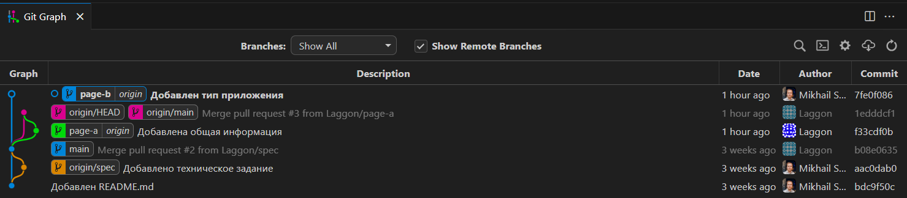

### Слияние из основной ветки

Слияние будем выполнять локальном репозитории.

Перед слиянием необходимо, чтобы в локальном репозитории основная ветка (например main) была с актуальными изменениями.

Для загрузки актуальных изменений основной ветки переключимся на нее (внизу слева) или командой:

```sh
git checkout main
```

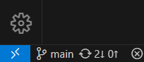

Далее вытянуть изменения из удаленного репозитория:

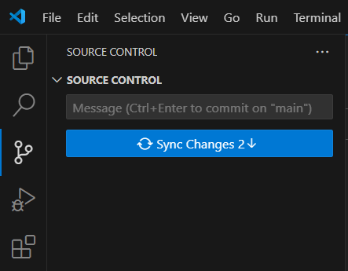

Или командой:

```sh
git pull
```

Если локальная ветка актуальная отобразиться сообщение `Already up to date.`, или список загруженных изменений.

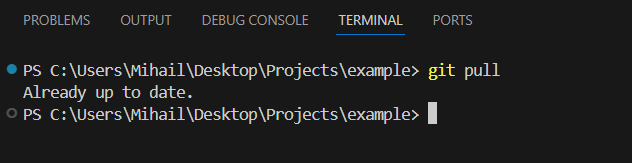

Далее возвращаемся в свою ветку.

Теперь локальная основная ветка находиться на актуальном коммите и можно перейти к слиянию в свою.

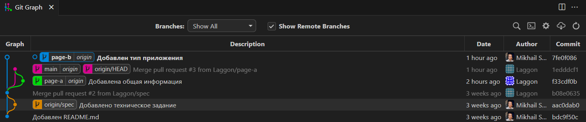

Для этого выполним команду:

```sh
git merge main
```

Если нет конфликтов, то слияние выполниться автоматически и останется только выполнить отправку (push) своей ветки и перейти к [Итогу](#итог).

### Исправление конфликтов

Этот раздел описывает исправление конфликтов при выполнении слияния изменений.

Пример сообщения:

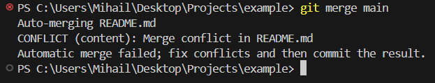

Во вкладке `Source Control` можно увидеть не завершенный merge commit.

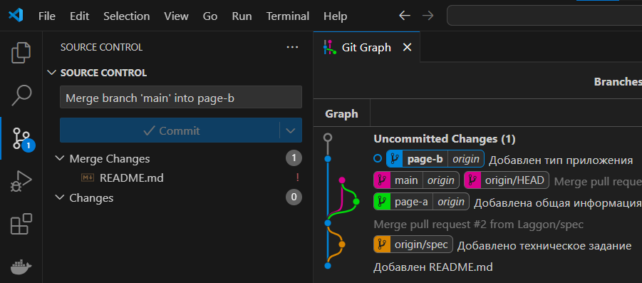

Сообщение оставляем по умолчанию.

Во списке `Changes` могут быть другие изменения, которые были применены автоматически их трогать не нужно.

На данный момент нужно работать со списком `Merge Changes` в котором отображаются файлы в которых имеются конфликты (также справа от них символ `!`).

Переходим к просмотру изменений данного файла.

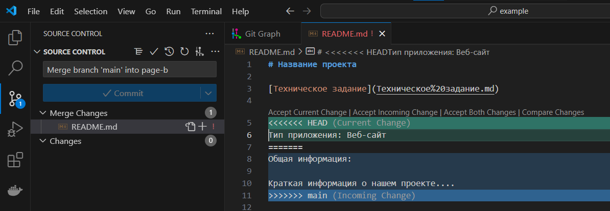

Отображаются два блока изменений:

* Current Change - наши изменения
* Incoming Change - изменения из источника (в данном случае main)

Действия которые предлагает `VS Code`:

* Accept Current Change - принять текущее изменение (оставить только наши изменения)
* Accept Incoming Change - принять входящее изменения (оставить только изменения из источника)
* Accept Both Changes - принять оба изменения
* Compare Changes - сравнить изменения (предпросмотр обоих изменений)

Наши действия:

* Если нужно какое-то одно изменение, то его и принять
* Если нужны оба изменения и/или при этом нужно внести правки, то удобнее выбрать принять оба изменения или сразу внести правки*

\* - На самом деле содержимое файла выглядит так (например в Блокноте)

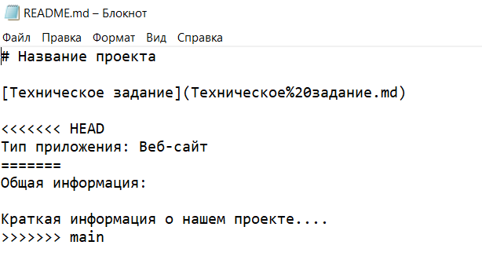

А VS Code выполняет подсветку с действиями, поэтому если необходимо можно в самом VS Code убрать спец символы (строки).

Соответственно приводим код к необходимому варианту.

В данном случае нам нужно сохранить оба блока, поэтому выбираем `Accept Both Changes` (или убираем вручную спец. символы-строки)

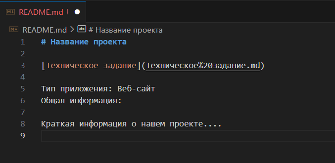

Чтобы текст корректно отображался (а не в одну строку) внесем перенос строки.

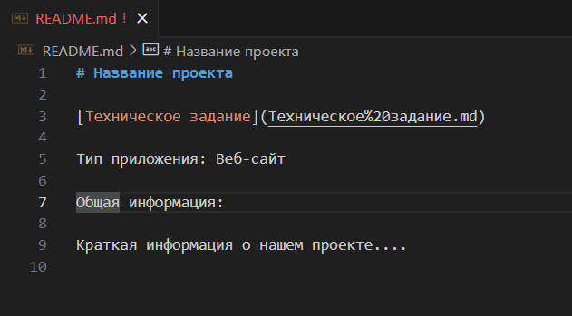

Перед завершением коммита стоит проверить корретность в данном случае отображение Markdown, а в случае кода, то запустить приложение и протестировать работоспособность.

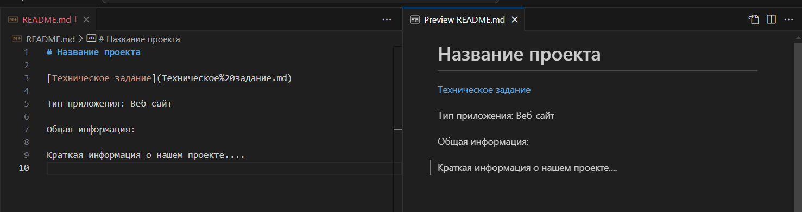

Далее переходим в `Source Control`. Файл все также отображется как требующий проверки.

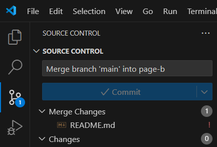

Если изменения корректны, необходимо подтвердить изменения нужно нажатием на `+` напротив него.

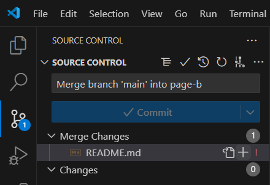

Тогда он станет отображатся в списке `Staged Changes` (изменения, которые будут включены в коммит).

И станет доступным `Commit`.

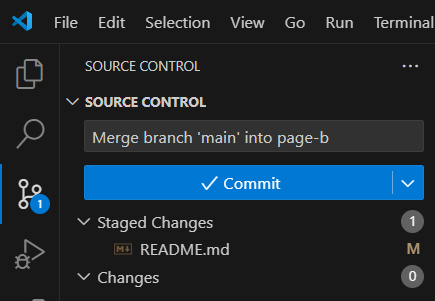

Также можно увидеть итоговые изменения при переходе к файлу.

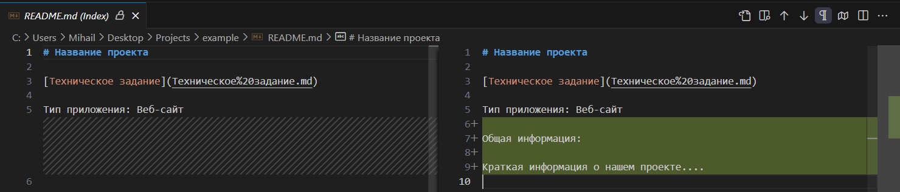

Далее выполняем коммит через интерфейс:

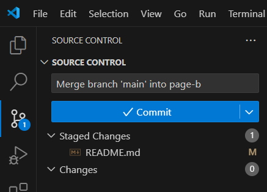

Или командой:

```sh
git commit -m "Merge branch 'main' into page-b"
```

На данный момент измения находятся только в локальном репозитории.

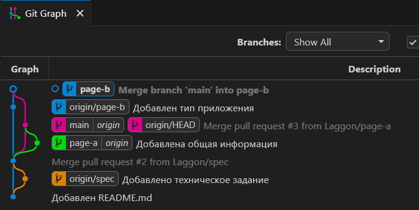

Необходимо отправить их в удаленный репозиторий (GitHub) с помощью `Sync Changes`.

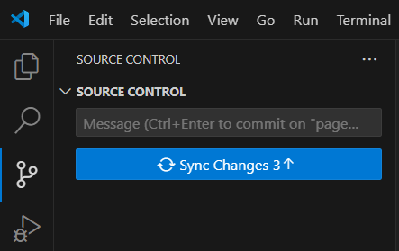

Или командой:

```sh
git push
```

После этого локальная и удаленная ветки будут указывать на нужный коммит.

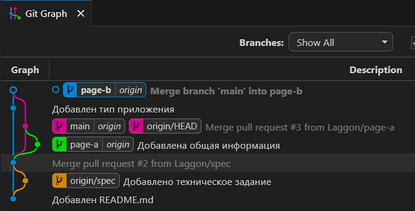

## Итог

Теперь на странице просмотра ветки отображается, что ветка содержит новые изменения (ahead) и нет отставания (behind).

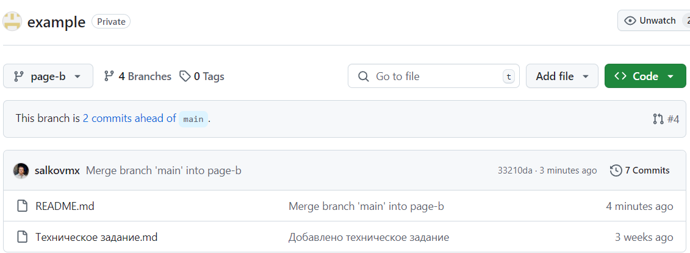

На странице PR теперь доступно слияние и нет предупреждения о конфликтах

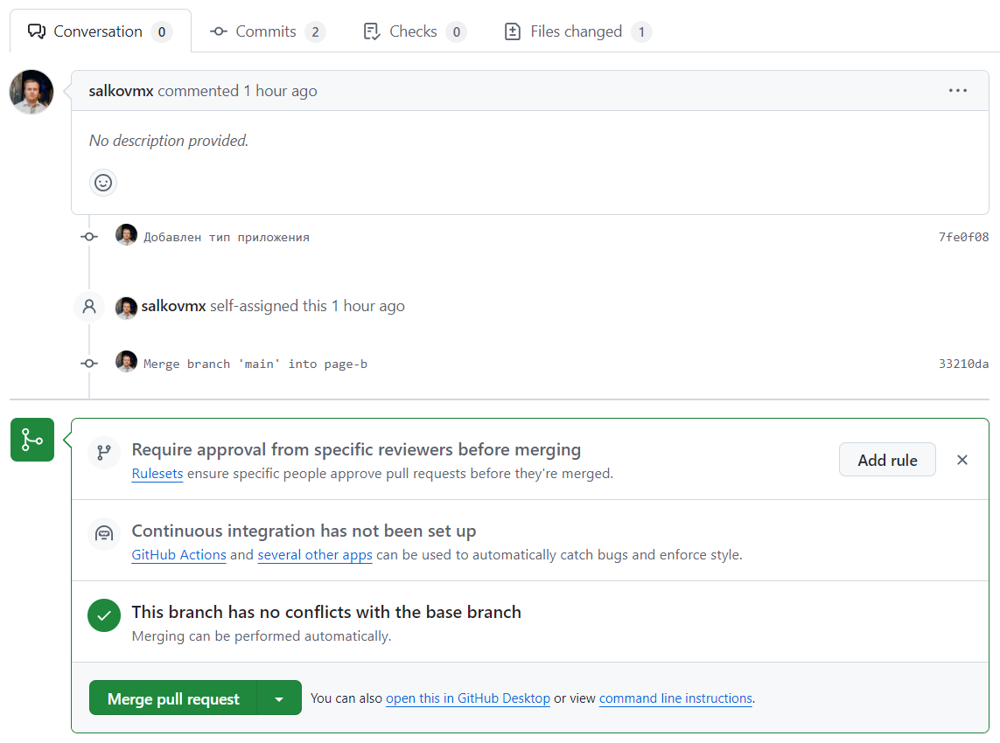

Далее в соответствии с порядком работ может потребоваться ревью и т.п.
