# Командная работа в GitHub

## Настройка ПО

### Клиент Git

[Скачать](https://git-scm.com/)

Саму настройку удобнее выполнять после установки Visual Studio Code. Открыв папку проекта и терминал (Terminal - New Terminal).

#### Настройка имени и email

Указать имя и email такой же как в аккаунте на GitHub.

```sh
git config --global user.name "John Doe"
git config --global user.email johndoe@example.com
```

#### Создание пары ssh-ключей

Выполнить команду `ssh-keygen` (нажать Enter, и если необходимо, то указать пароль)

Файл публичного ключа можно открыть сразу в VS Code (Ctrl + ЛКМ) или по пути в папке пользователя (например C:\Users\MyName\.ssh\id_rsa.pub)

Далее публичный ключ нужно добавить в свой аккаунт GitHub. Для этого перейти в Settings - SSH and GPG keys - New SSH key. Вставить содержимое из файла id_rsa.pub.

### Visual Studio Code (VS Code)

> Можно использовать другую среду разработки или редактор

[Скачать](https://code.visualstudio.com/) или [Скачать для Windows 8/8.1](https://code.visualstudio.com/updates/v1_79)

При установке рекомендуется указать:

* Создать значок на рабочем столе
* Добавить действие "Открыть с помощью Code" в контекстное меню файла проводника
* Добавить действие "Открыть с помощью Code" в контекстное меню каталога проводника

Рекомендуемые расширения (5 значок в панели слева):

* Russian Language Pack for Visual Studio Code (автор: Microsoft) - MS-CEINTL.vscode-language-pack-ru
* Git Graph (автор: mhutchie) - mhutchie.git-graph

## Настройка репозитория

Создать репозиторий в GitHub. Указать название и тип репозитория (приватный или публичный), а остальные параметры по умолчанию.

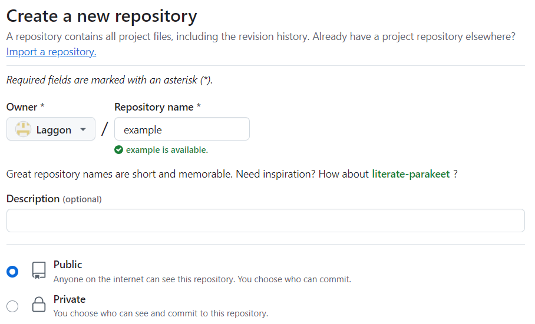

Пригласить участников проекта:

Для этого перейти в `Settings - Collaborators - Add people`

Приглашенному пользователю будет отправлено приглашение (которое действует 7 дней), после принятия приглашения он сможет участвовать в разработке проекта (отправлять код, а также можно будет запрашивать у него ревью)

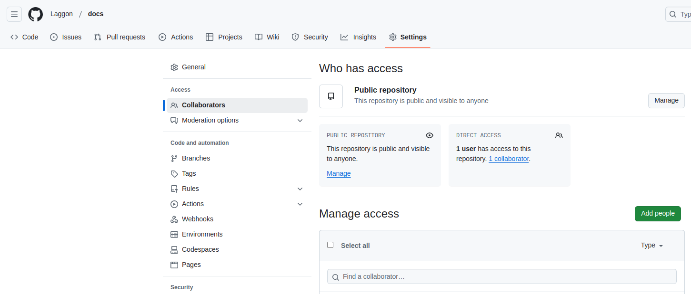

Далее для подключения к проекту скопировать адрес репозитория по протоколу SSH

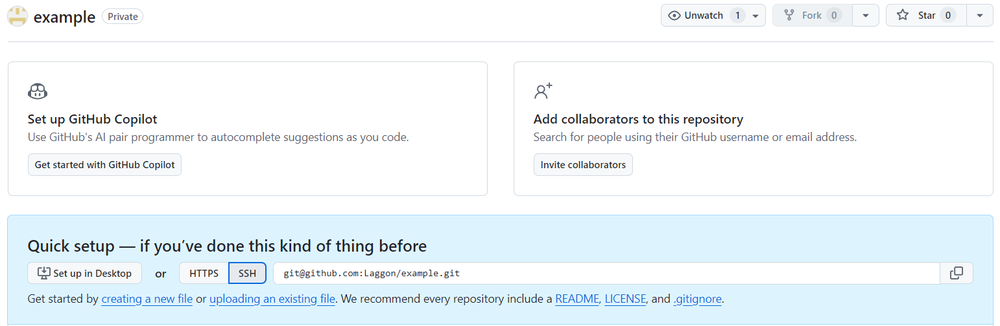

Создать папку проекта, например через проводник, и открыть ее через VS Code.

Далее выполнить команды, например как предлагает сам GitHub. Также их можно выполнить с помощью графического интерфейса.

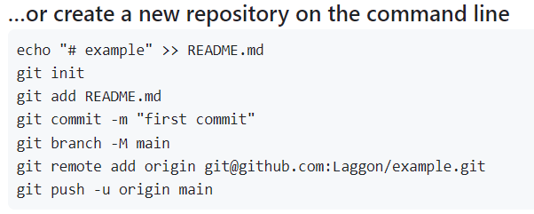

Создать файл `README.md` с содержимым:

```md
# Название проекта
```

В левой панели:

1. Работа с файлами как в обычном проводнике
2. Поиск и замена
3. Работа с системами контроля версий (Git)
4. Запуск (необходима настройка для работы)
5. Расширения

Интерфейс с добавленным файлом README.md:

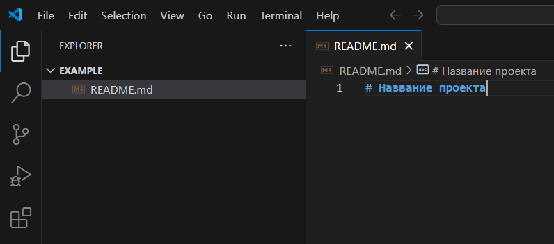

Инициализирование репозитория: Source Control - Initialize Repository (либо команда `git init`):

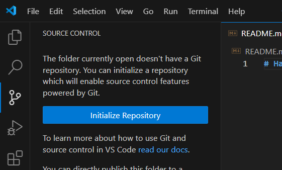

Далее необходимо включить файл в коммит (команда `git add README.md`):

Для этого в Source Control - Changes - выбранный файл (по клику на название можно увидеть вносимые изменения), для того чтобы включить его справа от его названия нажать `+`.

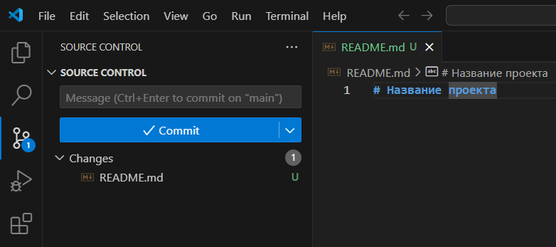

Изменения, которые будут включены в коммит отображаются в списке `Staged Changes`.

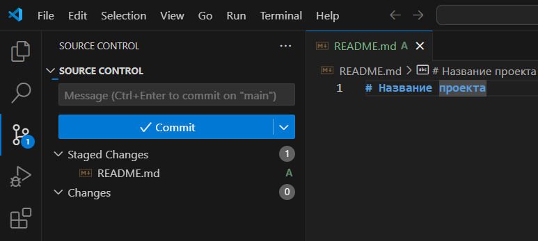

Далее указать `Message` (суть вносимых изменений, например: Добавлен README.md) и нажать `Commit` (команда `git commit -m "first commit"`).

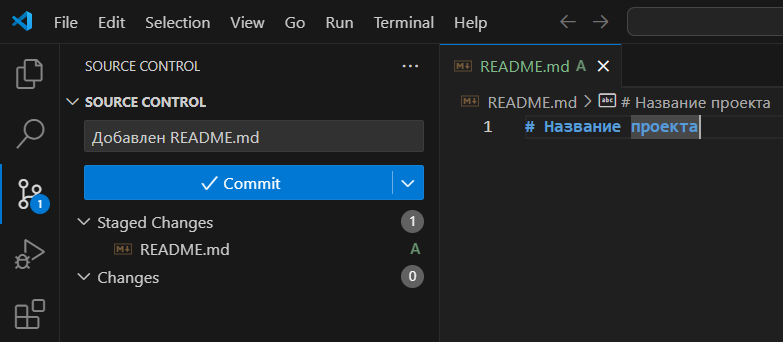

Далее подключить удаленный репозиторий (репозиторий на GitHub): Source Control - More actions - Remote - Add Remote (команда `git remote add origin git@github.com:Laggon/example.git`).

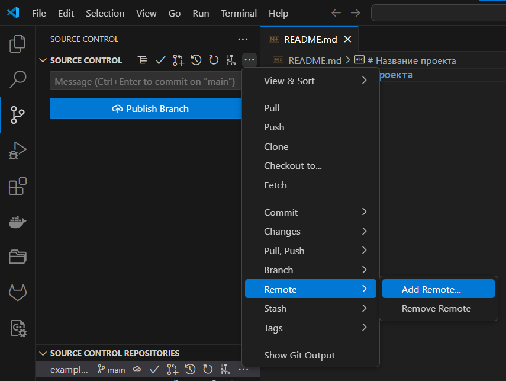

Указать путь к проекту на GitHub, например:

```sh
git@github.com:Laggon/example.git
```

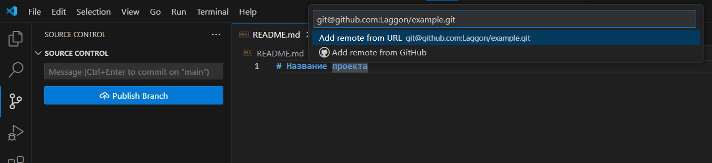

Указать название удаленного репозитория (обычно называют `origin`):

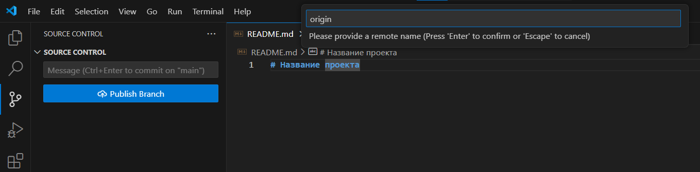

При первом подключении может просить подтвердить отпечаток ключа GitHub, выбрать: `yes`.

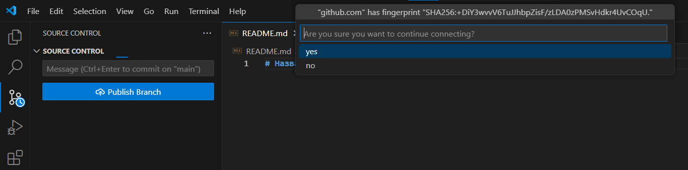

И может при запросе отпечатка отобразить ошибку, нажать `Cancel`.

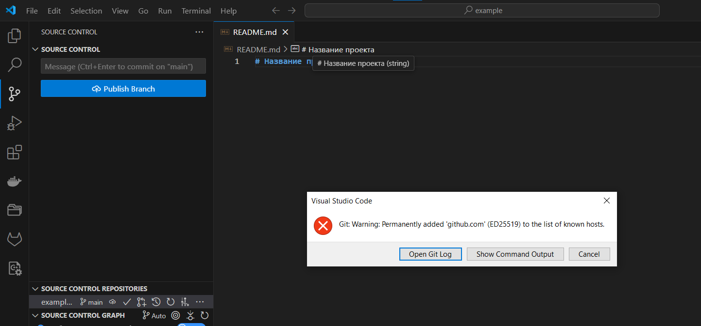

При установленном расширении Git Graph, доступен просмотр графического представления веток.

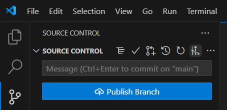

В нем можно увидеть коммиты и ветки в репозитории.

На данный момент имеется ветка `main`, которая находиться только в локальном репозитории.

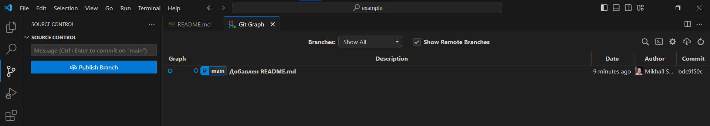

Публикация ветки в удаленный репозиторий (GitHub).

Для этого нажать кнопку Publish Branch (или выполнить команду `git push -u origin main`).

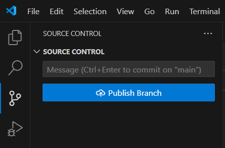

Если выводиться ошибка, то посмотреть подробности можно в Show Command Output.

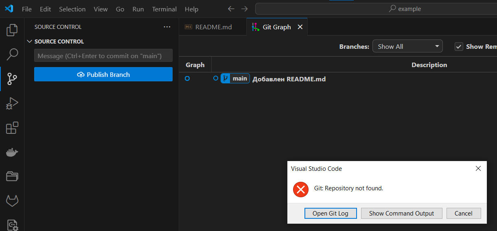

Если отображается подобная ошибка, значит не добавлен ssh ключ в аккаунт или некорректно указать путь к репозиторию.

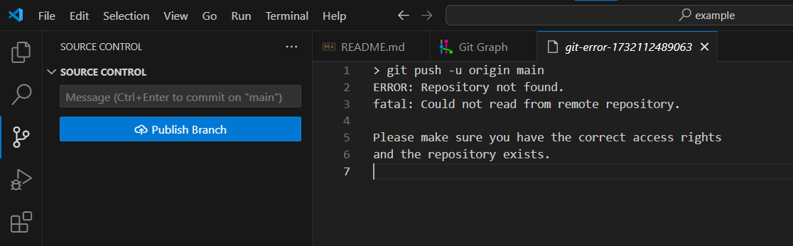

После публикации ветки, в Git Graph будет отображаться, что ветка main также соответствует удаленному репозиторию в GitHub.

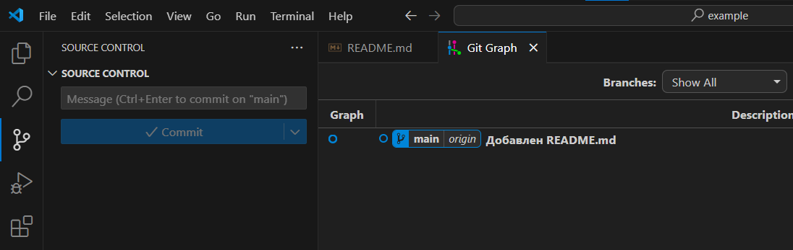

Можно убедиться в репозитории на GitHub.

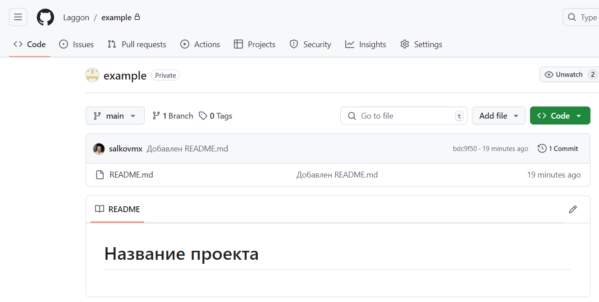
