# Работа с GitHub

## Milestones (этапы)

Для добавления переходим в Issues (или Pull requests) - Milestone - New milestone

Указать название, например:

```text
Подготовка проекта
```

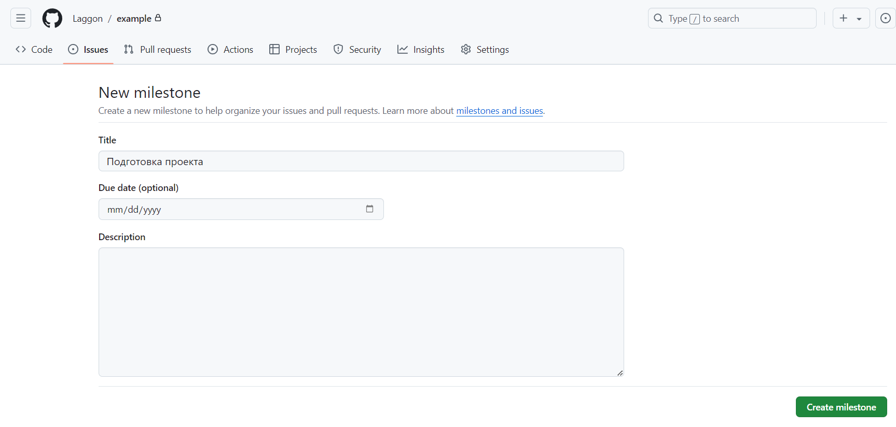

Также создать milestone для `Cпринт 2` и так далее.

## Issues (задачи)

Переходим в Issues - New Issue

Заполняем информацию о задаче:

* Title - Составить описание и техническое задание
* Description - ... (указано на рисунке)
* Assigness (ответственный за выполнение задачи), можно указать сразу себя или выбрать другого участника команды
* Labels (метки) - выбрать соответствующие метки (можно изменить на свои), в данном случае подходит `documentation`
* Milestone (этап) - в данном случае "Подготовка проекта"

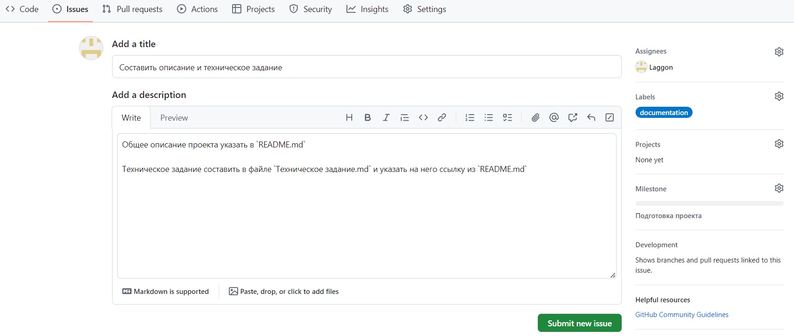

## Pull requests

PR (Pull request) используется для внесения изменений из одной ветки (в которой решается задача (issue)) в другую ветку (обычно в основную - main).

Для этого определяется с выбором задачи над которой будет вестись работа, например

```text
Составить описание и техническое задание (#1)
```

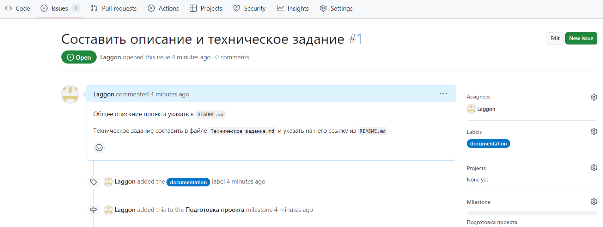

Открываем папку проекта в VS Code.

Слева внизу можно увидеть название текущей ветки.

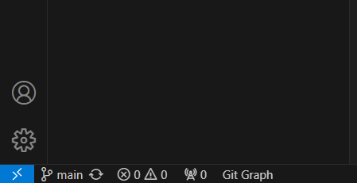

Необходимо быть на актуальном коммите ветки main. Для этого слева внизу рядом с названием ветки можно нажать Synchronize Changes.

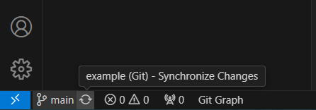

Или выполнить только вытягивание (pull) изменений: Source Control - More Actions - Pull, Push - Pull

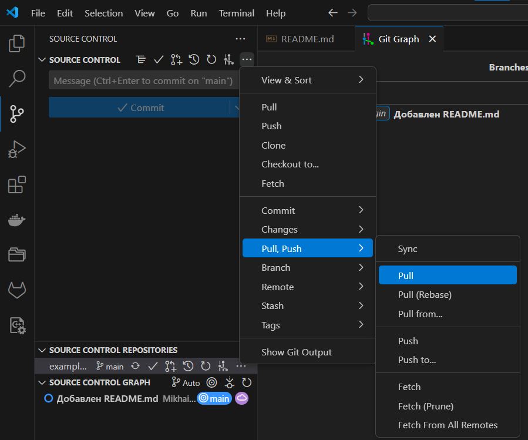

После этого убедиться, что ваша ветка находиться на том же коммите, что и в origin

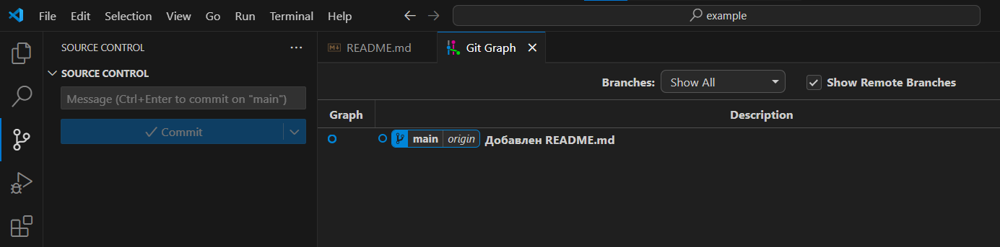

Теперь нужно создать ветку для работы над задачей #1

Можно нажать слева внизу на текущую ветку, и выбрать Create new branch

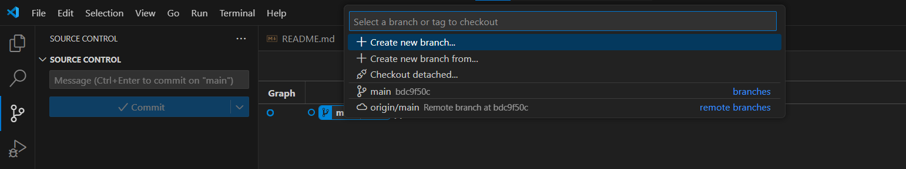

Ввести название новой ветки, обычно указывается в стиле (tech-spec или docs/tech-spec), укажем spec

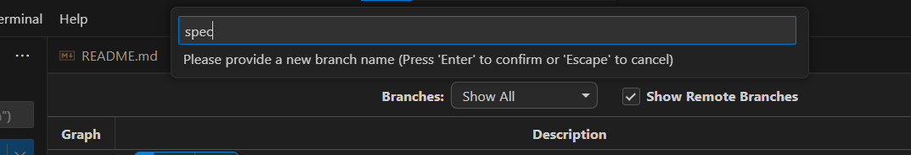

Увидеть, что теперь подключена новая ветка можно внизу слева и в Git Graph.

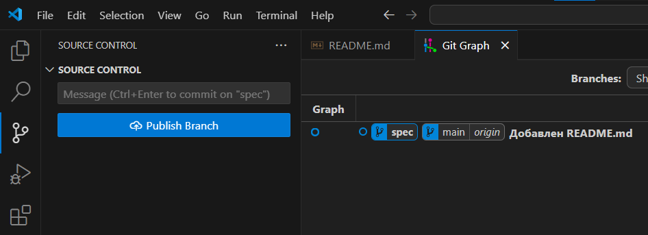

В соответствии с выбранной задачей добавим файл `Техническое задание.md`

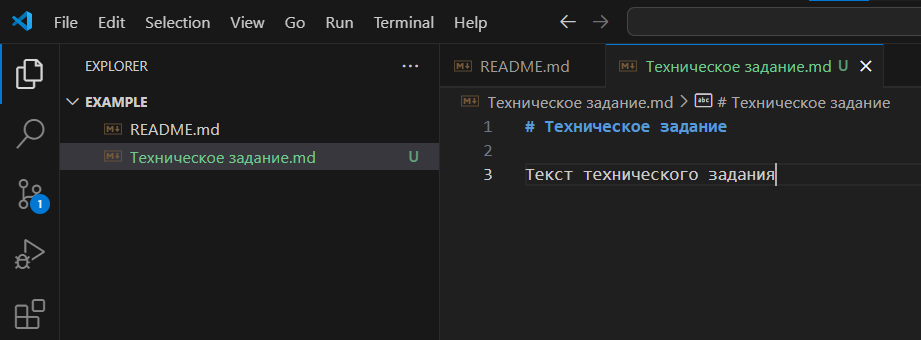

Также внесем изменения в файл `README.md` в соответствии с задачей

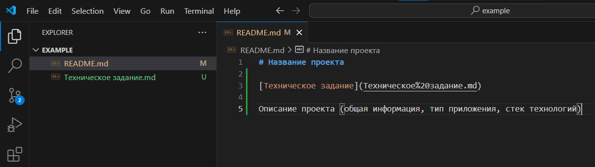

Далее переходим в Source Control и хорошей практикой является минимальный просмотр вносимых изменений в файл, чтобы случайно не добавить лишние файлы/текст/код.

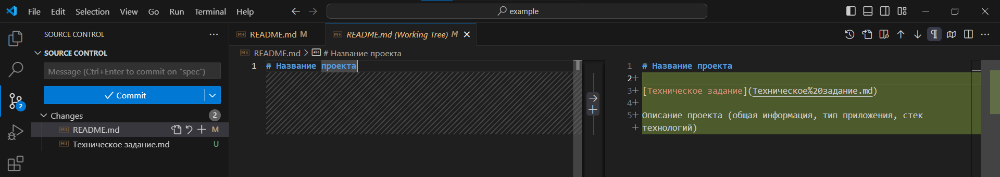

После проверки отмечаем файлы с помощью `+` напротив их имени. В список Staged Changes.

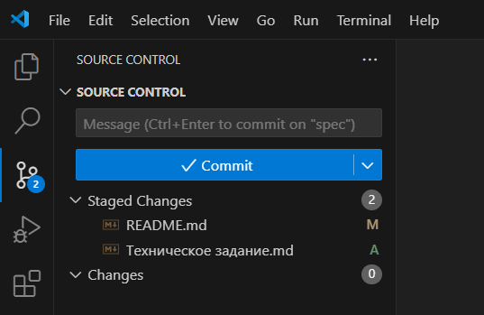

Указываем в Message суть вносимых изменений

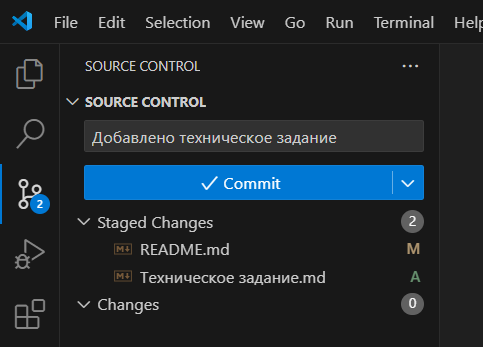

В Git Graph можем увидеть, что новый коммит был добавлен только в текущую ветку (spec), но не в main

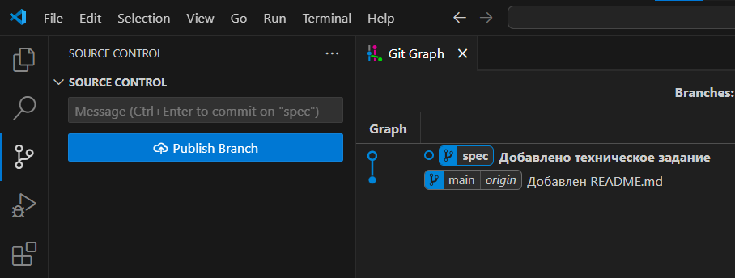

Теперь опубликуем ветку с помощью Public Branch. И увидим, что эта ветка также есть в удаленном репозитории (GitHub).

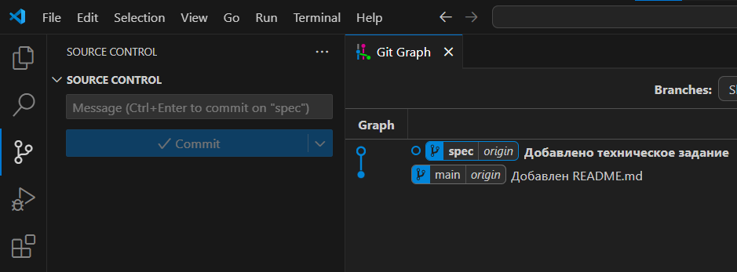

После публикования ветки GitHub сразу предлагает создать для нее PR - Compare & pull request

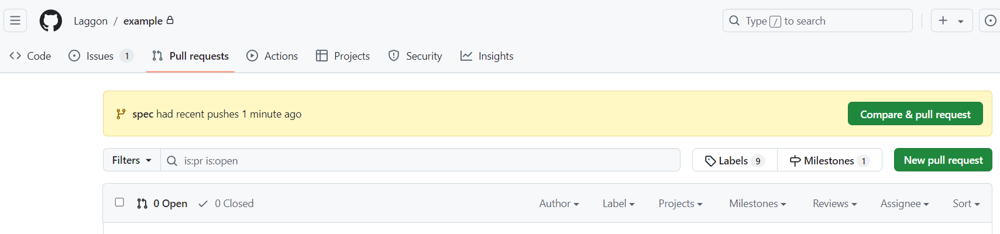

Иначе можно перейти в Pull requests - New pull request

И выбрать compare - spec (откуда брать изменения), а base - оставить main (куда вносить измения)

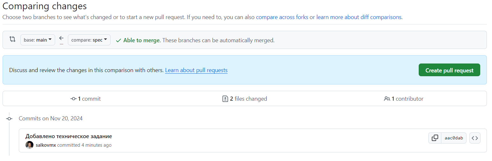

Ниже можно увидеть сравнение веток (вносимые изменения)

Их можно изменить в дальнейшем

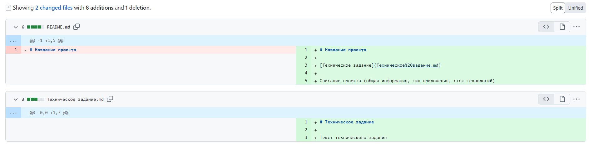

Создаем PR - Create pull request

Заполняем информацию о PR:

* Title - суть изменений для задачи (может совпадать с названием задачи)
* Description - указываем дополнительную информаци, если необходимо
* Reviewers - запрашиваем ревью (можно позже)
* Assignees (ответственный) - обычно тот же человек, что и в задаче
* Labes (метки) - обычно те же, что и в задаче
* Milestone (этап) - обычно такой же как и в задаче

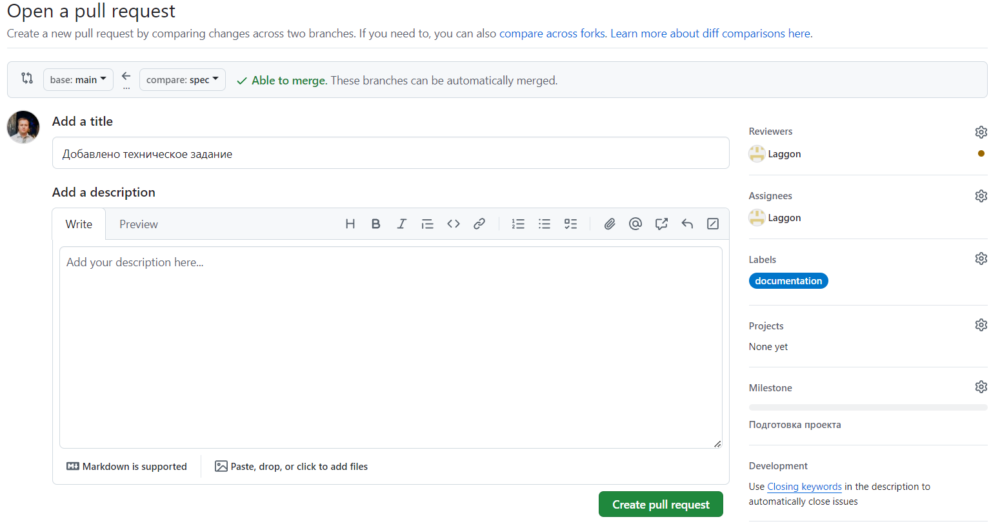

Также справа указать связанную задачу: Development

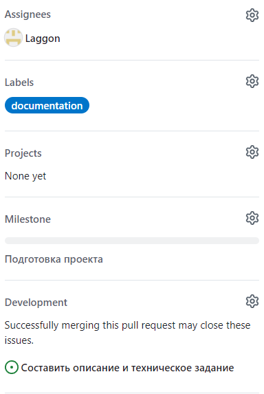

### Ревью (Review)

В верхней панели PR:

* Conversation - история активности, комментарии
* Commits (коммиты) - которые внесены в ветке (может быть несколько)
* Checks - относиться к CI/CD
* Files changed (изменения)

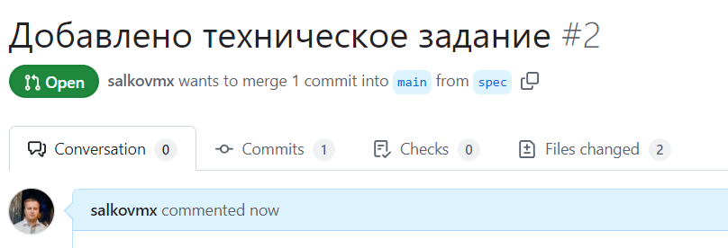

Ревью выполняется во вкладке Files changed

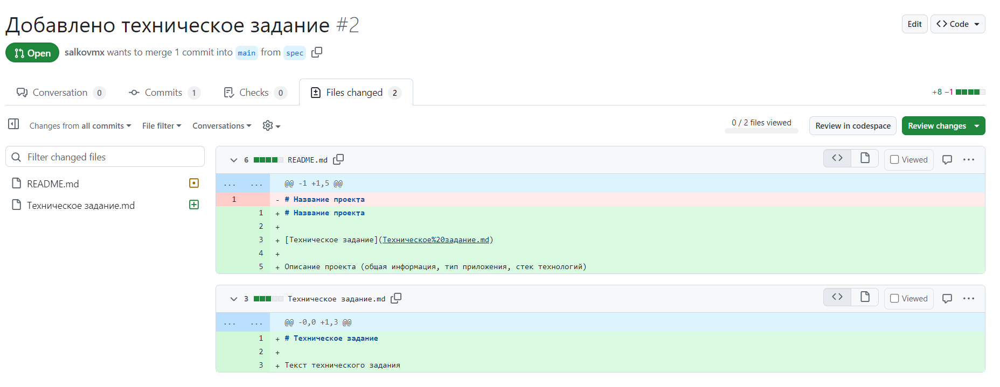

Так как эта задача связана с markdown-файлами, стоит также посмотреть итоговый вариант для этого можно перейти из подзаголовка PR в ветку `spec` (либо на странице Code переключить ветку).

Если PR связан с программным кодом стоит развернуть проект локально или на сервере, чтобы проверить работоспособность.

По стилю написания или работоспособности можно добавить комментарии:

* к строке/строкам
* к файлу
* общий комментарий (далее можно будет указать)

Ревью бывает 3-х типов:

* Comment - комментарий
* Approve - одобрение изменений
* Request changes - требуется исправления (стоит указать один или несколько комментариев)

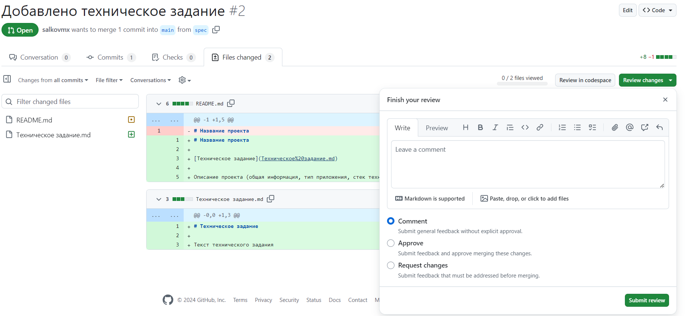

Если ревьюер требует внести исправления, то необходимо исправить и запросить снова ревью.

Если необходимо можно указать комментарий с уточняющими вопросами или предложением другого варианта исправления.

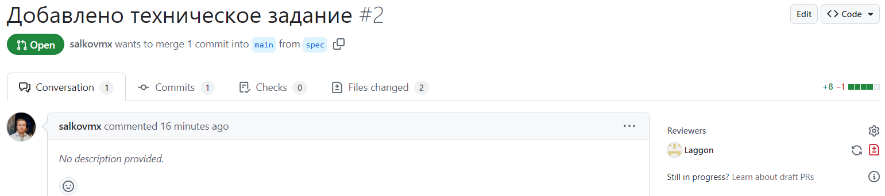

Если PR одобрен, то отображается зеленая галочка.

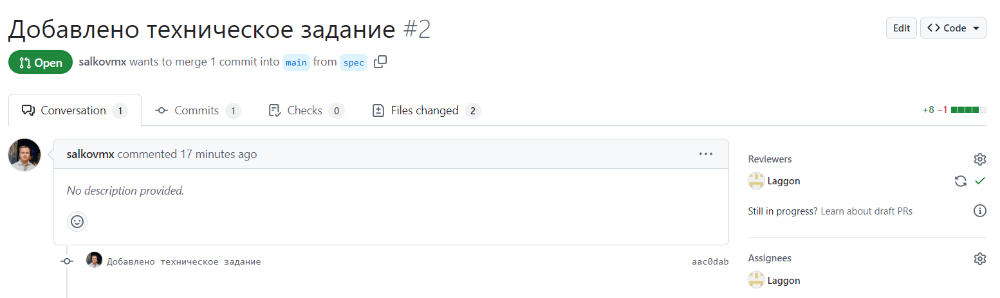

После одобрения PR, можно смержить изменения в основную ветку.

Для этого во вкладке Conversation (внизу) перейти к Changes approved.

Можно выполнить обычный Merge pull request (но в реальных проекта более предпочтительный вариант Squash and merge или Rebase and merge).

И выпонить Merge

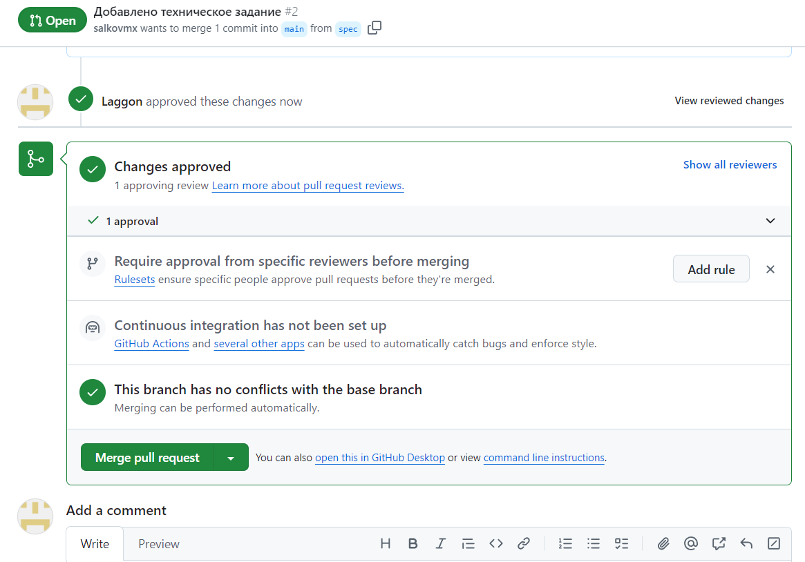

Если необходимо, то изменить сообщение и нажать Confirm merge

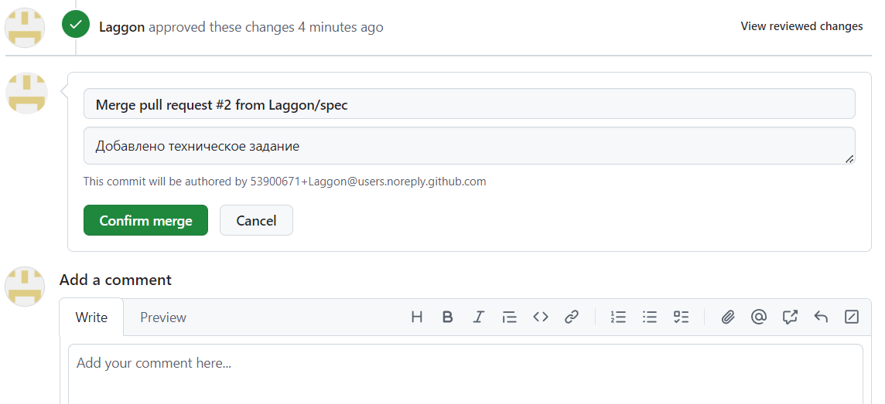

После мерджа (слияния изменений) в основную ветку, можно удалить ветку в которой велась работа: Delete branch (потом, если необходимо можно ее восстановить).

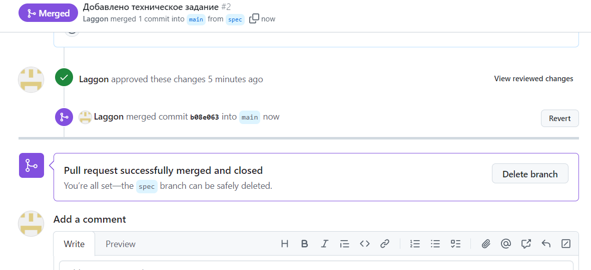

Теперь в основной ветке имеются изменения из PR

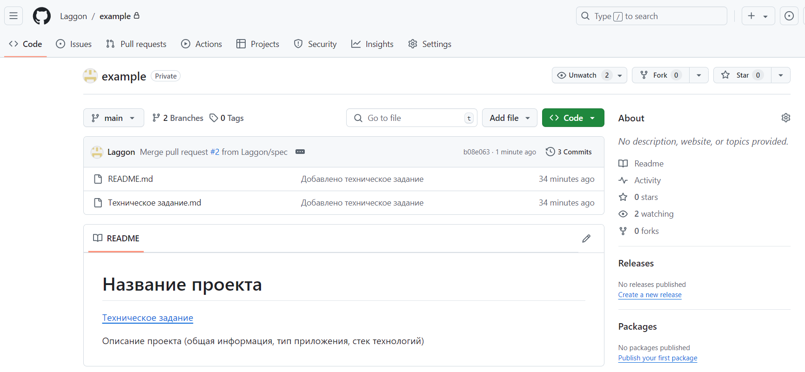

В локальном проекте можно выполнить Synchronize Changes (синхронизация изменений) или Pull (вытягивание изменений). Можно выполнить на следующем шаге.

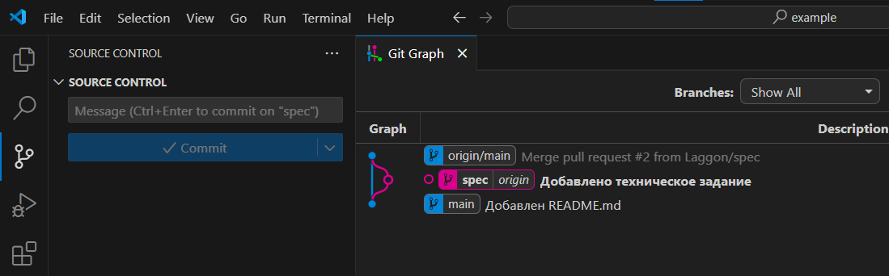

Слева внизу можем изменить ветку на main. И выполнить синхронизацию или вытягивание.

И теперь можем увидеть, что в основной ветке есть изменения из ветки `spec`

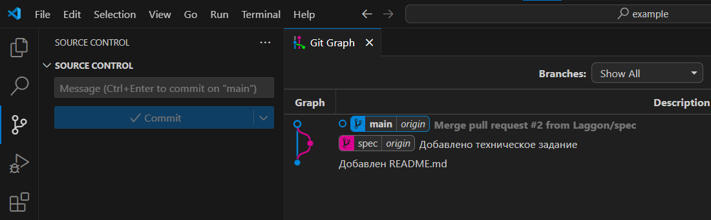
